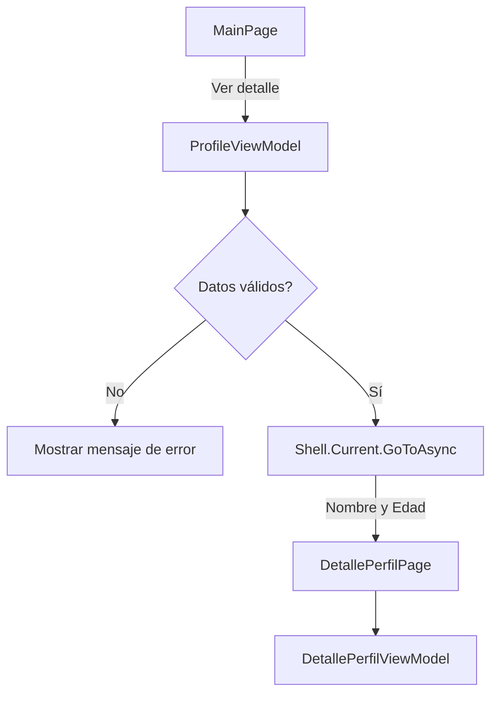

# PerfilAlumno

Aplicación desarrollada en .NET MAUI utilizando el patrón MVVM.

## Navegación

La navegación de la aplicación se encuentra centralizada en los ViewModels.

Desde la pantalla principal, el usuario puede seleccionar **Ver detalle**.  
El comando `VerDetalleCommand` del `ProfileViewModel` valida los datos ingresados antes de realizar la navegación.

Si el nombre está vacío o la edad es menor o igual a cero, se muestra un mensaje de error y no se realiza la navegación.

Si los datos son válidos, se utiliza `Shell.Current.GoToAsync()` para navegar hacia `DetallePerfilPage`, enviando el nombre y la edad como parámetros.

`DetallePerfilViewModel` recibe estos parámetros mediante `QueryProperty` y los muestra en la pantalla de detalle.

## Flujo de navegación

## Estructura utilizada

- `MainPage.xaml`: pantalla principal del perfil.
- `ProfileViewModel.cs`: contiene los comandos, validaciones y navegación.
- `DetallePerfilPage.xaml`: pantalla que muestra los datos recibidos.
- `DetallePerfilViewModel.cs`: recibe los parámetros de navegación.
- `AppShell.xaml.cs`: registra la ruta hacia la pantalla de detalle.

## Validaciones

Antes de navegar se verifica que:

- El nombre no esté vacío.
- La edad sea mayor a cero.

De esta forma se evita enviar parámetros incorrectos a la pantalla de detalle.